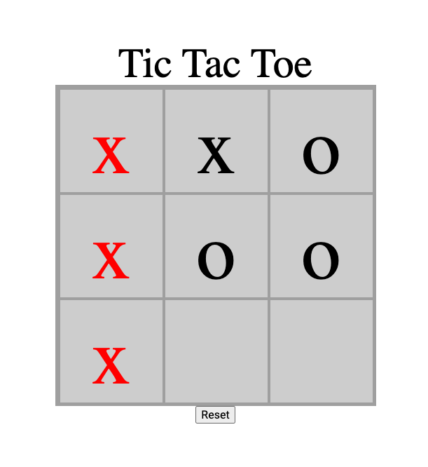

# tic-tac-toe

A JavaScript tic tac toe game for a web browser

## Description
While browsing classmates repositories for any interesting projects i came across this not quite functional version of tic tac toe.
I took it upon myself to study and comment on the code line by line to understand it's logic. I have brought the code into what I consider a working state but there are still some issues i have with it. Mainly that I want to have a better way of changing the styles of the boxes involved in the winning moves played. and I would like to add an 'AI' to play against some day also.

## Issues
none currently found! :) 

